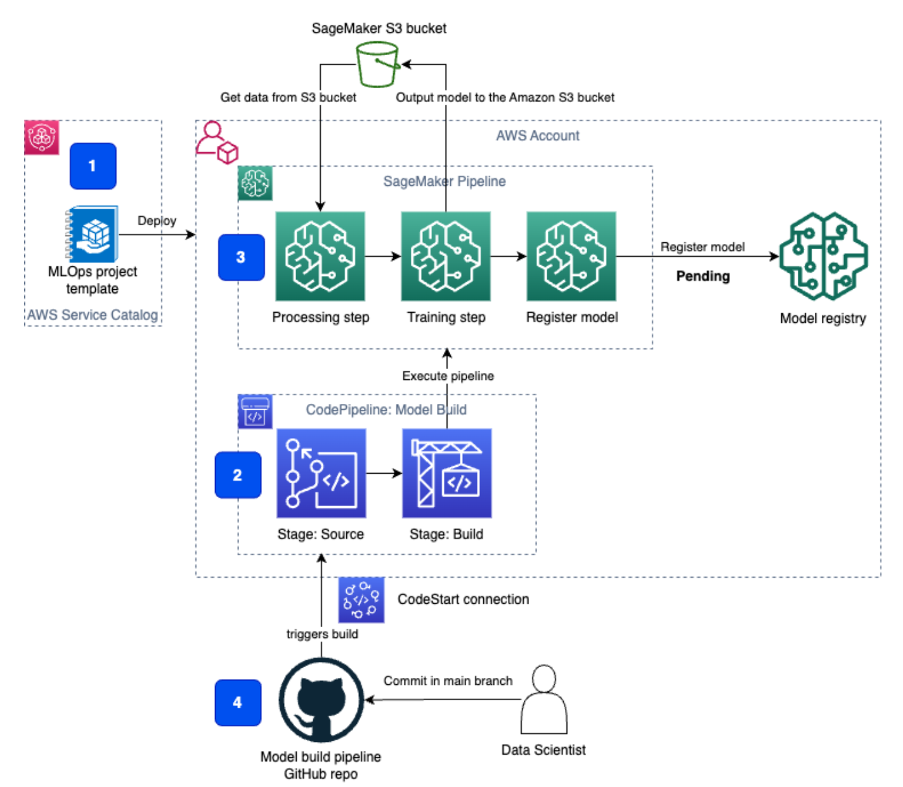

# DepositAI – Predicting Term Deposit Subscription

DepositAI is a machine learning project that predicts whether a customer of a Portuguese bank will subscribe to a **term deposit** (variable: `y`) based on demographic, financial, and marketing interaction data. The goal is to support targeted marketing decisions and improve campaign efficiency.

This project uses the **Bank Marketing Dataset** from direct marketing campaigns conducted via phone calls. The dataset includes customer attributes, previous contact history, campaign metadata, and socio-economic indicators.

---

## Project Objective

To build, evaluate, and interpret ML models that can:
- Predict the likelihood of a customer subscribing to a term deposit.
- Identify key factors influencing subscription decisions.
- Provide explainable insights for targeted marketing strategies.

---

## Dataset Description

**Source:** Portuguese banking institution  
**Rows:** 41,188  
**Features:** 20 (input) + 1 target (`y`)

| Column Group | Description |
|-------------|-------------|
| Client Information | age, job, marital status, education, default, housing loan, personal loan |
| Contact Information | contact communication type, month, day of week, last contact duration |
| Campaign Metadata | number of contacts, days since last contact, campaign frequency |
| Economic Indicators | employment variation rate, consumer price index, EURIBOR rate, etc. |
| **Target (Label)** | `y` → `yes` or `no` (term deposit subscription) |

---

## Tech Stack

| Category | Tools |
|---------|-------|
| Language | Python |
| Data Processing | Pandas, NumPy |
| Visualization | Matplotlib, Seaborn |
| Modeling | Scikit-Learn |
| Evaluation | Precision, Recall, F1-Score, ROC-AUC |
| Explainability | Feature Importance, Correlation Analysis |

---

## Methodology

1. **Exploratory Data Analysis (EDA)**  
   - Understanding distributions, patterns, correlations.
   - Identifying campaign trends.

2. **Pre-processing**
   - Handling missing values
   - Encoding categorical variables
   - Scaling numerical features

3. **Model Development**
   - Baseline: Logistic Regression
   - Advanced: Random Forest, XGBoost, SVM (optional)

4. **Model Evaluation**
   - Balanced metrics for imbalanced dataset
   - ROC-AUC curve and confusion matrix

5. **Interpretation & Insights**
   - Key predictors of term deposit subscription
   - Actionable business recommendations

---

## Key Business Insights (Example Outcomes)

- **Call duration** strongly influences subscription — longer engagement correlates with higher success.
- Previous campaign outcomes and contact history provide critical predictive signal.
- Economic context (EURIBOR rate, employment variation) impacts customer decision trends.

---

## Repository Structure

```

DepositAI/
│
├── data/                 # Dataset files (bank-additional-full.csv)
├── notebooks/            # Jupyter Notebooks for EDA and modeling
├── src/                  # Python modules for data processing and modeling
├── models/               # Saved trained models
├── results/              # Evaluation reports & visualizations
└── README.md             # Project documentation

````

---

## How to Run

```bash
# Clone this repository
git clone https://github.com/smaliaquib/DepositAI.git
cd DepositAI

# Install dependencies
pip install -r requirements.txt

# Run the notebook or script
jupyter notebook notebooks/analysis.ipynb
````

---

## Future Improvements

* Deploy model via FastAPI or Flask API.
* Build interactive visualization dashboard (Streamlit / Gradio).
* Hyperparameter tuning using Optuna / Ray Tune.

---

## Reference

Moro, S., Cortez, P., & Rita, P. (2014). *A Data-Driven Approach to Predict the Success of Bank Telemarketing.* Expert Systems with Applications.

---

## Contributions

Contributions are welcome! Please feel free to submit issues or pull requests.

---

## Support

If you like this project, consider giving it a **star** ⭐ on GitHub — it helps a lot!
